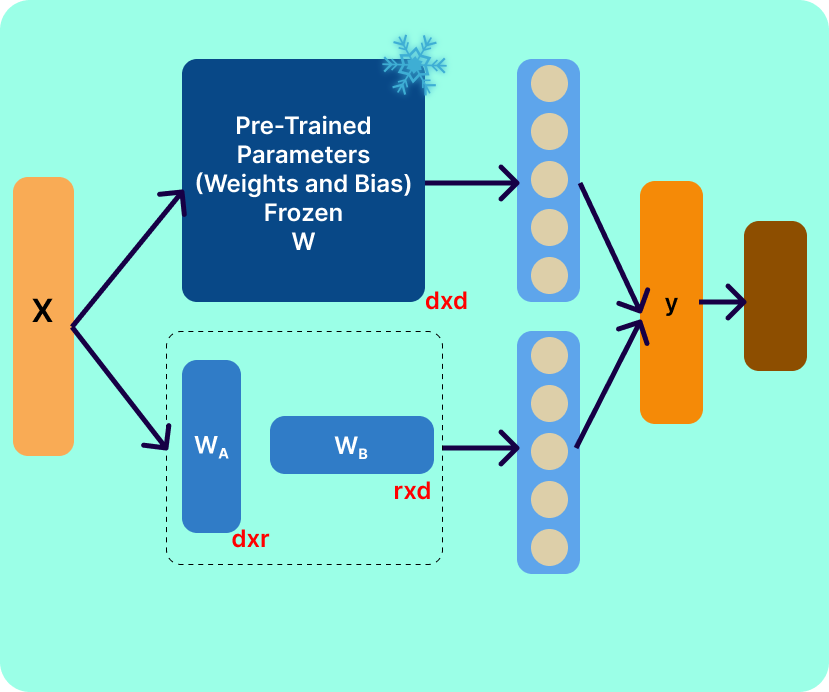
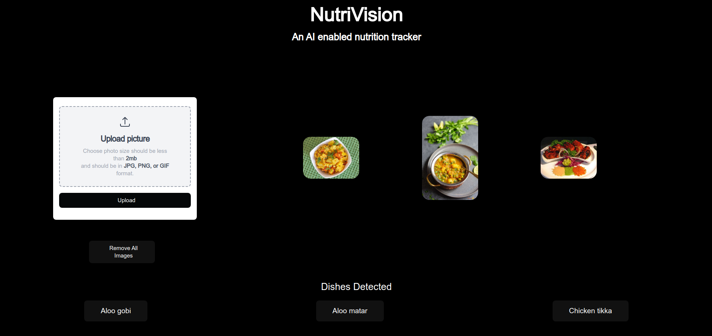
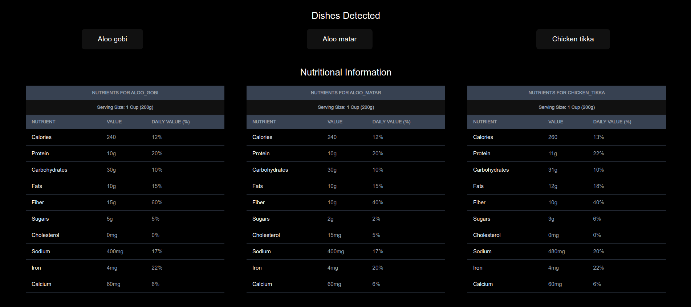

# Nutrivision

The aim of this project is to create a comprehensive image classification and advice generation system which takes the images of food product and estimate the calories in that and then give appropriate amount one should take to maintain his/her diet.

Link to the frontend: [Nutrivision-Frontend](https://github.com/Anurag-Deo/Nutrivision-Frontend)


## Run Locally

Clone the project

```bash
  git clone https://link-to-project
```

Go to the project directory

```bash
  cd Nutrivision-Backend
```

Create and activate environment

```bash
  conda create -n nutrivision python=3.10
  conda activate nutrivision
```

Install dependencies

```bash
  cd environment
  conda install --yes --file requirements1.yml
  conda install --yes --file requirements2.yml
```

Start the server

```bash
  python3 detect.py
  python3 main.py
  python3 retrival.py
```


## Environment Variables

To run this project, you will need to update the following variables in the retrival.py

`GPT_API_KEY`

`GEMINI_API_KEY`

`ANTHROPIC_API_KEY`


## API Reference

#### Get all items

```http
  GET :8001/nutritional_info
```

| Parameter | Type     | Description                |
| :-------- | :------- | :------------------------- |
| `dish` | `string` | **Required**. The dish for which we want the nutritional values to be extracted. |

#### Get item

```http
  GET :8002/info_gemini/invoke
```

| Parameter | Type     | Description                       |
| :-------- | :------- | :-------------------------------- |
| `'input':{'dish':dish}`      | `json` | **Required**. Internal call to fetch the data from gemini |

```http
  GET :8002/info_gpt/invoke
```

| Parameter | Type     | Description                       |
| :-------- | :------- | :-------------------------------- |
| `'input':{'dish':dish}`      | `json` | **Required**. Internal call to fetch the data from gpt |


```http
  GET :8002/info_claude/invoke
```

| Parameter | Type     | Description                       |
| :-------- | :------- | :-------------------------------- |
| `'input':{'dish':dish}`      | `json` | **Required**. Internal call to fetch the data from claude |

```http
  GET :8003/detect
```

| Parameter | Type     | Description                       |
| :-------- | :------- | :-------------------------------- |
| `file`      | `file` | **Required**. Image of the food item for the classification |


## Screenshots






## Demo

https://github.com/Anurag-Deo/Nutrivision-Backend/assets/92918449/127c6751-050e-4539-b439-d35d24b2b96d


